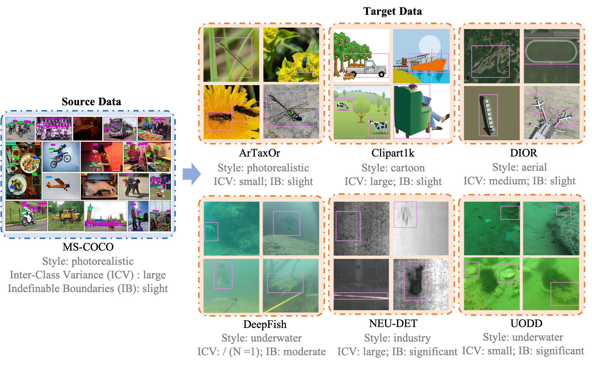

Biography
------
I am currently a visiting scholar at <a href="https://soai.sjtu.edu.cn/">Scholar of Artifical Intelligence, SJTU</a>. Right before, I worked as a research scientist at <a href="https://insait.ai/">INSAIT</a>, Sofia, Bulgaria, working with Prof. <a href="https://insait.ai/prof-luc-van-gool/">Luc Van Gool</a> and Dr. <a href="https://insait.ai/dr-danda-paudel/">Danda Paudel</a>. Previously, I was a postdoc researcher at <a href="https://vision.ee.ethz.ch/">Computer Vision Lab (CVL)</a>, ETH Zürich,  Switzerland, where I was also fortunate to be mentored by Prof. <a href="https://ee.ethz.ch/the-department/faculty/professors/person-detail.OTAyMzM=.TGlzdC80MTEsMTA1ODA0MjU5.html">Luc Van Gool</a>. 

I received my Ph.D. degree from School of Computer Science, Fudan University, China,  in June 2023, advised by Prof. <a href="https://fvl.fudan.edu.cn/people/yugangjiang">Yu-Gang Jiang</a> and co-advised by Prof. <a href="https://yanweifu.github.io/">Yanwei Fu</a>. During my Ph.D studies, I also worked closely with Associate Professor <a href="http://vireo.cs.cityu.edu.hk/jingjing">Jingjing Chen</a>. Before that, I received my bachelor’s degree in computer science from Zhejiang University of Technology, China, in June 2018, supervised by Associate Professor <a href ="http://www.homepage.zjut.edu.cn/congbai/">Cong Bai</a>.

My research topics are computer vision and deep learning. I mainly aim to build more generalizable vision models by addressing challenges that arise when applying them to downstream tasks, such as few-shot learning,  cross-domain learning, open-vocabulary learning, and multimodal fusion.  Recently, my interests have expanded toward cross-view learning, particularly in bridging exo-centric and ego-centric vision. I am excited about advancing intelligent assistants for egocentric vision understanding.

<i>
📮 If you're interested in discussing potential collaborations, especially on the topic with egocentric vision, please feel free to drop an email to me: <strong>yuqian.fu.ai@gmail.com</strong>.
</i> 

<!-- <i>
🚀 Thanks to the funding from Google, we are opening new PhD positions 
to explore exciting frontiers in <strong>egocentric vision with MLLMs</strong>. If you are interested, please feel free to apply on <a href="https://insait.ai/phd/" target="_blank"><strong>https://insait.ai/phd/</strong></a> and drop me an email: <strong>yuqian.fu@insait.ai</strong>.
</i> -->

 <!--I am currently a Ph.D. Candidate at <a href="https://fvl.fudan.edu.cn">FVL</a> Lab, Fudan University, advised by Prof. <a href="https://fvl.fudan.edu.cn/people/yugangjiang">Yu-Gang Jiang</a>, co-advised by Prof. <a href="https://yanweifu.github.io/">Yanwei Fu</a>, and Associate Professor <a href="http://vireo.cs.cityu.edu.hk/jingjing">Jingjing Chen</a>. Before that, I received my bachelor’s degree in computer science from Zhejiang University of Technology, Hangzhou, China, in 2018, supervised by Associate Professor <a href ="http://www.homepage.zjut.edu.cn/congbai/">Cong Bai</a>. My current research topics are computer vision and deep learning, and I am mainly focused on few-shot learning especially cross-domain few-shot learning, and few-shot video action recognition.--> 
  

News
------
<ul>
  <li>[01/2026] Two papers are accepted by IRCA 2026. Check out <a href="https://arxiv.org/pdf/2510.11566">SCOOP'D</a> and <a href="">OCRA</a>.</li>
  <li>[01/2026] Two papers are accepted by ICLR 2026. Check out <a href="https://arxiv.org/pdf/2510.06218?">EgoNight</a> and <a href="https://arxiv.org/pdf/2505.18679?">MIRAGE</a>.</li>
  <li>[01/2026] Two papers are accepted by AAAI 2025. Check out <a href="https://arxiv.org/pdf/2508.10729">EgoCross</a> and <a href="https://arxiv.org/pdf/2511.15580">CompTrack</a>.</li>
  <li>[09/2025] Two papers are accepted by NeurIPS 2025. Check out <a href="https://arxiv.org/pdf/2506.05872?">Domain-RAG</a> and <a href="https://arxiv.org/pdf/2503.19730?">CamSAM2</a>.</li>
  <li>[08/2025] Excited to share that our project on <strong>egocentric vision with MLLMs</strong> has been funded by Google. PhD positions will be announced soon — stay tuned! <a href="https://www.linkedin.com/posts/martinvechev_insait-google-ai-activity-7365662899433783296-Zwjk?utm_source=share&utm_medium=member_ios&rcm=ACoAAE8Eu5AB0jJHHV4bVOWa2UW5mJaECUQ62Uk" target="_blank">More details here.</a></li>
  <li>[08/2025] One paper is accepted by TPAMI. Congrats to Jianxiong. Check out <a href="https://arxiv.org/abs/2409.11315">MinD-3D++</a>.</li>
  <li>[08/2025] I was promoted to Research Scientist at INSAIT.</li>
  <li>[06/2025] Four papers are accepted by ICCV 2025. Check out <a href="https://arxiv.org/pdf/2411.19083">ObjectRelator (<strong>Highlight</strong>)</a>, <a href="https://arxiv.org/pdf/2507.23567?">3D-MOOD</a>, <a href="https://arxiv.org/pdf/2405.17773">XTrack</a>, and <a href="https://arxiv.org/pdf/2412.01370">Museum</a>.</li>
  <li>[06/2025] Two papers are accepted by IROS 2025. Check out <a href="https://arxiv.org/pdf/2506.18856">RAG-6DPose</a> and <a href="https://arxiv.org/pdf/2503.09078">SeqMultiGrasp</a>.</li>
  <li>[06/2025] We were awarded 2nd place in the Correspondences track of the 2025 EgoVis Ego-Exo4D Challenge. Technical report <a href="https://arxiv.org/abs/2506.05856">here</a>. </li>
  <li>[04/2025] We successfully hosted the 1-st CD-FSOD Challenge @ NTIRE CVPR Workshop 2025. Workshop paper <a href="https://arxiv.org/pdf/2504.10685">here</a>. </li>
  <li>[01/2025] One paper is accepted by RA-L. Congrats to Tim. </li>
  <li>[12/2024] One paper is accepted by AAAI 2025. Congrats to Jiancheng.</li>
  <li>[07/2024] We have relaunched the <a href="http://yuqianfu.com/UnrealAction-Dataset">UnrealAction</a> dataset. </li>
  <li>[07/2024] Two papers are accepted by ECCV 2024. Congrats to Jianxiong, Yu, and Yixuan.</li>
  <li>[04/2024] I joined INSAIT as a postdoc researcher. </li>
  <li>[12/2023] One paper is accepted by AAAI 2024. Congrats to Wentao.</li>
  <li>[09/2023] I joined CVL lab at ETH Zürich. </li>
  <li>[07/2023] One paper is accepted by ACM MM 2023. </li>
  <li>[06/2023] I have earned a doctoral degree. </li>
  <li>[04/2023] I have received 100 citations! </li>
  <li>[02/2023] One paper is accepted by CVPR 2023. </li>
  <li>[10/2022] One paper is accepted by TIP. </li>
  <li>[06/2022] Two papers are accepted by ACM MM 2022.</li>
  <li>[12/2021] I am recognized as an outstanding student of Fudan University.</li>
  <li>[06/2021] One paper is accepted by ACM MM 2021.</li>
  <li>[04/2021] One paper is accepted by ICMR 2021.</li>
  <li>[07/2020] One paper is accepted by ACM MM 2020.</li>
  <li>[12/2019] I am awarded the Chinese National Scholarship.</li>
  <li>[07/2019] One paper is accepted by ACM MM 2019.</li>
  <li>[09/2018] I joined FVL lab at Fudan University. </li>
</ul>

<!-- Selected Publications
# To update this
------

            

                
            
     
            

            
<a href="">ME-D2N: Multi-Expert Domain Decompositional Network for Cross-Domain Few-Shot Learning</a> <strong>Yuqian Fu</strong>, Yu Xie, Yanwei Fu, Jingjing Chen, Yu-Gang Jiang  ACM International Conference on Multimedia (<strong>ACM MM</strong>), 2022.  [<a href="">Paper Coming Soon</a>][<a href="https://github.com/lovelyqian/ME-D2N_for_CDFSL">Code</a>]

            

 -->

Selected Publications
------
<table style="width:100%">
  <tr>
    <th width="30%">
      
    </th>
    <th style="text-align:left" width="70%">
            EgoNight: Towards Egocentric Vision Understanding at Night with a Challenging Benchmark 
             
            Deheng Zhang, <strong>Yuqian Fu ‡</strong>, Runyi Yang, Yang Miao, Tianwen Qian, Xu Zheng, Guolei Sun, Ajad Chhatkuli, Xuanjing Huang, Yu-Gang Jiang, Luc Van Gool, Danda Pani Paudel
             
              International Conference on Learning Representations (<strong>ICLR</strong>), 2026 
            [<a href="https://arxiv.org/pdf/2510.06218?">Paper</a>][<a href="">Code</a>][<a href="">Project Page </a>]
    </th>
  </tr> 
</table>

<table style="width:100%">
  <tr>
    <th width="30%">
      
    </th>
    <th style="text-align:left" width="70%">
            EgoCross: Benchmarking Multimodal Large Language Models for Cross-Domain Egocentric Video Question Answering 
             
            Yanjun Li, <strong>Yuqian Fu</strong>, Tianwen Qian, Qi'ao Xu, Silong Dai, Danda Pani Paudel, Luc Van Gool, Xiaoling Wang
             
              The AAAI Conference on Artificial Intelligence (<strong>AAAI</strong>), 2025 
            [<a href="https://arxiv.org/pdf/2508.10729">Paper</a>][<a href="https://github.com/MyUniverse0726/EgoCross">Code</a>][<a href="https://egocross-benchmark.github.io/">Project Page </a>]
    </th>
  </tr> 
</table>

<table style="width:100%">
  <tr>
    <th width="30%">
      
    </th>
    <th style="text-align:left" width="70%">
            Domain-RAG: Retrieval-Guided Compositional Image Generation for Cross-Domain Few-Shot Object Detection 
             
            Yu Li, Xingyu Qiu, <strong>Yuqian Fu ‡</strong>, Jie Chen, Tianwen Qian, Xu Zheng, Danda Pani Paudel, Yanwei Fu, Xuanjing Huang, Luc Van Gool, Yu-Gang Jiang
             
              Conference on Neural Information Processing Systems (<strong>NeurIPS</strong>), 2025 
            [<a href="https://arxiv.org/pdf/2506.05872?">Paper</a>][<a href="">Code</a>][<a href="">Youtube Video (Coming Soon) </a>][<a href="">Bilibili Video (Coming Soon) </a>][<a href="">Project Page </a>]
    </th>
  </tr> 
</table>

<table style="width:100%">
  <tr>
    <th width="30%">
      
    </th>
    <th style="text-align:left" width="70%">
            ObjectRelator: Enabling Cross-View Object Relation Understanding in Ego-Centric and Exo-Centric Perspectives 
             Yuqian Fu, Runze Wang, Bin Ren, Guolei Sun, Biao Gong, Yanwei Fu, Danda Pani Paudel, Xuanjing Huang, Luc Van Gool 
              International Conference on Computer Vision (<strong>ICCV Highlight</strong>), 2025 
            [<a href="https://arxiv.org/pdf/2411.19083">Paper</a>][<a href="https://github.com/lovelyqian/ObjectRelator">Code</a>][<a href="">Youtube Video (Coming Soon) </a>][<a href="">Bilibili Video (Coming Soon) </a>][<a href="http://yuqianfu.com/ObjectRelator/">Project Page </a>]
    </th>
  </tr> 
</table>

<table style="width:100%">
  <tr>
    <th width="30%">
      
    </th>
    <th style="text-align:left" width="70%">
            RAG-6DPose: Retrieval-Augmented 6D Pose Estimation via Leveraging CAD as Knowledge Base
             
            Kuanning Wang, <strong>Yuqian Fu ‡</strong>, Tianyu Wang, Yanwei Fu, Longfei Liang, Yu-Gang Jiang, Xiangyang Xue
             
             International Conference on Intelligent Robots and Systems (<strong>IROS</strong>), 2025 
            [<a href="https://arxiv.org/pdf/2506.18856">Paper</a>][<a href="">Code (Coming Soon)</a>][<a href="https://sressers.github.io/RAG-6DPose/">Project Page </a>]
    </th>
  </tr> 
</table>

<table style="width:100%">
  <tr>
    <th width="30%">
      
    </th>
    <th style="text-align:left" width="70%">
            CAFuser: Condition-Aware Multimodal Fusion for Robust Semantic Perception of Driving Scenes
             
            Tim Brodermann ‡, Christos Sakaridis, <strong>Yuqian Fu ‡</strong>, Luc Van Gool
             
             IEEE Robotics and Automation Letters (<strong>RAL</strong>), 2025 
            [<a href="https://arxiv.org/abs/2410.10791">Paper</a>][<a href="https://github.com/timbroed/CAFuser">Code</a>]
    </th>
  </tr> 
</table>

<table style="width:100%">
  <tr>
    <th width="30%">
      
    </th>
    <th style="text-align:left" width="70%">
            Locate Anything on Earth: Advancing Open-Vocabulary Object Detection for Remote Sensing Community
             
             Jiancheng Pan, Yanxing Liu, <strong>Yuqian Fu ‡</strong>, Muyuan Ma, Jiahao Li, Danda Pani Paudel, Luc Van Gool, Xiaomeng Huang ‡
             
             The AAAI Conference on Artificial Intelligence (<strong>AAAI</strong>), 2025 
            [<a href="https://arxiv.org/pdf/2408.09110">Paper</a>][<a href="https://github.com/jaychempan/LAE-DINO">Code</a>][<a href="https://www.bilibili.com/video/BV1YWAkeMEGz/?vd_source=668a0bb77d7d7b855bde68ecea1232e7">Bilibili Video</a>][<a href="https://jianchengpan.space/LAE-website/index.html">Project Page </a>]
    </th>
  </tr> 
</table>

<table style="width:100%">
  <tr>
    <th width="30%">
      
    </th>
    <th style="text-align:left" width="70%">
            Cross-Domain Few-Shot Object Detection via Enhanced Open-Set Object Detector 
            Yuqian Fu, Yu Wang, Yixuan Pan, Lian Huai, Xingyu Qiu, Zeyu Shangguan, Tong Liu, Yanwei Fu, Luc Van Gool, Xingqun Jiang 
             The European Conference on Computer Vision (<strong>ECCV</strong>), 2024 
            [<a href="https://arxiv.org/pdf/2402.03094">Paper</a>][<a href="https://github.com/lovelyqian/CDFSOD-benchmark">Code</a>][<a href="https://www.youtube.com/watch?v=t5vREYQIup8">Youtube Video</a>][<a href="https://www.bilibili.com/video/BV17v4UetEdF/?vd_source=668a0bb77d7d7b855bde68ecea1232e7#reply113142138936707">Bilibili Video</a>][<a href="http://yuqianfu.com/CDFSOD-benchmark">Project Page</a>]
    </th>
  </tr> 
</table>

<table style="width:100%">
  <tr>
    <th width="30%">
      
    </th>
    <th style="text-align:left" width="70%">
            StyleAdv: Meta Style Adversarial Training for Cross-Domain Few-Shot Learning 
            Yuqian Fu, Yu Xie, Yanwei Fu, Yu-Gang Jiang 
             IEEE/CVF Conference on Computer Vision and Pattern Recognition (<strong>CVPR</strong>), 2023 
            [<a href="https://arxiv.org/pdf/2302.09309.pdf">Paper</a>][<a href="https://github.com/lovelyqian/StyleAdv-CDFSL">Code</a>][<a href="https://youtu.be/YB-S2YF22mc">Youtube Video</a>][<a href="https://www.bilibili.com/video/BV1th4y1s78H/?spm_id_from=333.999.0.0&vd_source=668a0bb77d7d7b855bde68ecea1232e7">Bilibili Video</a>][<a href="http://yuqianfu.com/PJ-StyleAdv">Project Page</a>]
    </th>
  </tr> 
</table>

<table style="width:100%">
  <tr>
    <th width="30%">
      
    </th>
    <th style="text-align:left" width="70%">
            Generalized Meta-FDMixup: Cross-Domain Few-Shot Learning Guided by Labeled Target Data 
            Yuqian Fu, Yanwei Fu, Jingjing Chen, Yu-Gang Jiang 
            IEEE Transactions on Image Processinig (<strong>TIP</strong>), 2022. 
            [<a href="https://ieeexplore.ieee.org/stamp/stamp.jsp?tp=&arnumber=9942934">Paper</a>]
    </th>
  </tr> 
</table>

<table style="width:100%">
  <tr>
    <th width="30%">
      
    </th>
    <th style="text-align:left" width="70%">
            ME-D2N: Multi-Expert Domain Decompositional Network for Cross-Domain Few-Shot Learning 
            Yuqian Fu, Yu Xie, Yanwei Fu, Jingjing Chen, Yu-Gang Jiang 
            ACM International Conference on Multimedia (<strong>ACM MM</strong>), 2022. 
            [<a href="https://arxiv.org/pdf/2210.05280.pdf">Paper</a>][<a href="https://github.com/lovelyqian/ME-D2N_for_CDFSL">Code</a>][<a href="https://www.youtube.com/watch?v=crCoaBLuFeA">Youtube Video</a>][<a href="https://www.bilibili.com/video/BV1GG4y1p7if/?vd_source=668a0bb77d7d7b855bde68ecea1232e7">Bilibili Video</a>]
    </th>
  </tr> 
</table>

<table style="width:100%">
  <tr>
    <th width="30%">
      
    </th>
    <th style="text-align:left" width="70%">
            TGDM: Target Guided Dynamic Mixup for Cross-Domain Few-Shot Learning 
            Linhai Zhuo, Yuqian Fu, Jingjing Chen, Yixin Cao, Yu-Gang Jiang 
            ACM International Conference on Multimedia (<strong>ACM MM</strong>), 2022. 
            [<a href="https://arxiv.org/pdf/2210.05392.pdf">Paper</a>]
    </th>
  </tr> 
</table>

<table style="width:100%">
  <tr>
    <th width="30%">
       
    </th>
    <th style="text-align:left" width="70%">
  Wave-SAN: Wavelet based Style Augmentation Network for Cross-Domain Few-Shot Learning 
            Yuqian Fu, Yu Xie, Yanwei Fu, Jingjing Chen, Yu-Gang Jiang 
            arXiv preprint, 2022. 
            [<a href="https://arxiv.org/pdf/2203.07656.pdf">Paper</a>][<a href="https://github.com/lovelyqian/wave-SAN-CDFSL">Code</a>]
    </th>
  </tr> 
</table>

<table style="width:100%">
  <tr>
    <th width="30%">
      
    </th>
    <th style="text-align:left" width="70%">
            Meta-FDMixup: Cross-Domain Few-Shot Learning Guided by Labeled Target Data 
            Yuqian Fu, Yanwei Fu, Yu-Gang Jiang 
            ACM International Conference on Multimedia (<strong>ACM MM</strong>), 2021. 
            [<a href="https://arxiv.org/pdf/2107.11978.pdf">Paper</a>][<a href="https://github.com/lovelyqian/Meta-FDMixup">Code</a>][<a href="https://www.youtube.com/watch?v=G8Mlde4FpsU">Youtube Video</a>][<a href="https://www.bilibili.com/video/BV1xT4y1f7B6?spm_id_from=333.999.0.0&vd_source=668a0bb77d7d7b855bde68ecea1232e7">Bilibili Video</a>][<a href="http://yuqianfu.com/PJ-MetaFDMixup">Project Page</a>]
    </th>
  </tr> 
</table>

<table style="width:100%">
  <tr>
    <th width="30%">
      
    </th>
    <th style="text-align:left" width="70%">
            Can Action be Imitated? Learn to Reconstruct and Transfer Human Dynamics from Videos 
            Yuqian Fu, Yanwei Fu, Yu-Gang Jiang 
            International Conference on Multimedia Retrieval (<strong>ICMR</strong>). 2021. (<strong>Oral</strong>) 
            [<a href="https://arxiv.org/pdf/2107.11756.pdf">Paper</a>][<a href="https://www.bilibili.com/video/BV1VY41147xt?spm_id_from=333.999.0.0">Bilibili Video</a>]
    </th>
  </tr> 
</table>

<table style="width:100%">
  <tr>
    <th width="30%">
      
    </th>
    <th style="text-align:left" width="70%">
             Depth Guided Adaptive Meta-Fusion Network for Few-shot Video Recognition 
            Yuqian Fu, Li Zhang, Junke Wang, Yanwei Fu, Yu-Gang Jiang 
            ACM International Conference on Multimedia (<strong>ACM MM</strong>), 2020. (<strong>Oral</strong>) 
            [<a href="https://arxiv.org/pdf/2010.09982.pdf">Paper</a>][<a href="https://github.com/lovelyqian/AMeFu-Net">Code</a>][<a href="https://www.youtube.com/watch?v=KqNYuZD5xdw">Youtube Video</a>][<a href="https://www.bilibili.com/video/BV1i44y1t78U?spm_id_from=333.999.0.0">Bilibili Video</a>][<a href="http://yuqianfu.com/PJ-AMeFuNet">Project Page</a>]
    </th>
  </tr> 
</table>

<table style="width:100%">
  <tr>
    <th width="30%">
      
    </th>
    <th style="text-align:left" width="70%">
            Embodied One-Shot Video Recognition: Learning from Actions of a Virtual Embodied Agent 
            Yuqian Fu, Chengrong Wang, Yanwei Fu, Yu-Xiong Wang, Cong Bai, Xiangyang Xue, Yu-Gang Jiang 
            ACM International Conference on Multimedia (<strong>ACM MM</strong>), 2019. (<strong>Oral</strong>) 
             [<a href="http://www.cs.cmu.edu/~yuxiongw/research/Embodied_One-Shot_Video_Recognition_Learning_from_Actions_of_a_Virtual_Embodied_Agent.pdf">Paper</a>][<a href="https://github.com/lovelyqian/Embodied-One-Shot-Video-Recognition">Code</a>][<a href="http://yuqianfu.com/UnrealAction-Dataset">UnrealAction Dataset</a>]
    </th>
  </tr> 
</table>

<!-- <ul>
  <li>
    
<a href="">ME-D2N: Multi-Expert Domain Decompositional Network for Cross-Domain Few-Shot Learning</a> <strong>Yuqian Fu</strong>, Yu Xie, Yanwei Fu, Jingjing Chen, Yu-Gang Jiang  ACM International Conference on Multimedia (<strong>ACM MM</strong>), 2022.  [<a href="">Paper Coming Soon</a>][<a href="https://github.com/lovelyqian/ME-D2N_for_CDFSL">Code</a>]

  </li>
  <li>
    
<a href="">TGDM: Target Guided Dynamic Mixup for Cross-Domain Few-Shot Learning</a> Linhai Zhuo, <strong>Yuqian Fu</strong>, Jingjing Chen, Yixin Cao, Yu-Gang Jiang  ACM International Conference on Multimedia (<strong>ACM MM</strong>), 2022.  [<a href="">Paper Coming Soon</a>]

  </li>
  <li>
    
<a href="https://arxiv.org/abs/2203.07656">Wave-SAN: Wavelet based Style Augmentation Network for Cross-Domain Few-Shot Learning</a>  <strong>Yuqian Fu</strong>, Yu Xie, Yanwei Fu, Jingjing Chen, Yu-Gang Jiang  arXiv preprint, 2022.   [<a href="https://arxiv.org/pdf/2203.07656.pdf">Paper</a>]

  </li>
  <li>
    
<a href="https://arxiv.org/abs/2107.11978">Meta-FDMixup: Cross-Domain Few-Shot Learning Guided by Labeled Target Data</a> <strong>Yuqian Fu</strong>, Yanwei Fu, Yu-Gang Jiang  ACM International Conference on Multimedia (<strong>ACM MM</strong>), 2021.   [<a href="https://arxiv.org/pdf/2107.11978.pdf">Paper</a>][<a href="https://github.com/lovelyqian/Meta-FDMixup">Code</a>][<a href="https://www.youtube.com/watch?v=G8Mlde4FpsU">Youtube Video</a>][<a href="https://www.bilibili.com/video/BV1xT4y1f7B6?spm_id_from=333.999.0.0&vd_source=668a0bb77d7d7b855bde68ecea1232e7">Bilibili Video</a>]

  </li>
  <li>
    
<a href="https://arxiv.org/abs/2107.11756">Can Action be Imitated? Learn to Reconstruct and Transfer Human Dynamics from Videos</a> <strong>Yuqian Fu</strong>, Yanwei Fu, Yu-Gang Jiang  International Conference on Multimedia Retrieval (<strong>ICMR</strong>). 2021. (<strong>Oral</strong>)  [<a href="https://arxiv.org/pdf/2107.11756.pdf">Paper</a>][<a href="https://www.bilibili.com/video/BV1VY41147xt?spm_id_from=333.999.0.0">Bilibili Video</a>]

  </li>
  <li>
    
<a href="https://arxiv.org/abs/2010.09982">Depth Guided Adaptive Meta-Fusion Network for Few-shot Video Recognition
</a> <strong>Yuqian Fu</strong>, Li Zhang, Junke Wang, Yanwei Fu, Yu-Gang Jiang  ACM International Conference on Multimedia (<strong>ACM MM</strong>), 2020. (<strong>Oral</strong>)  [<a href="https://arxiv.org/pdf/2010.09982.pdf">Paper</a>][<a href="https://github.com/lovelyqian/AMeFu-Net">Code</a>][<a href="https://www.youtube.com/watch?v=KqNYuZD5xdw">Youtube Video</a>][<a href="https://www.bilibili.com/video/BV1i44y1t78U?spm_id_from=333.999.0.0">Bilibili Video</a>]

  </li>
  <li>
    
<a href="http://www.cs.cmu.edu/~yuxiongw/research/Embodied_One-Shot_Video_Recognition_Learning_from_Actions_of_a_Virtual_Embodied_Agent.pdf"> Embodied One-Shot Video Recognition: Learning from Actions of a Virtual Embodied Agent </a>  <strong>Yuqian Fu</strong>, Chengrong Wang, Yanwei Fu, Yu-Xiong Wang, Cong Bai, Xiangyang Xue, Yu-Gang Jiang  ACM International Conference on Multimedia (<strong>ACM MM</strong>), 2019. (<strong>Oral</strong>)   [<a href="http://www.cs.cmu.edu/~yuxiongw/research/Embodied_One-Shot_Video_Recognition_Learning_from_Actions_of_a_Virtual_Embodied_Agent.pdf">Paper</a>][<a href="https://github.com/lovelyqian/Embodied-One-Shot-Video-Recognition">Code</a>][<a href="http://www.sdspeople.fudan.edu.cn/fuyanwei/dataset/UnrealAction/">UnrealAction Dataset</a>]

  </li>
</ul> -->

