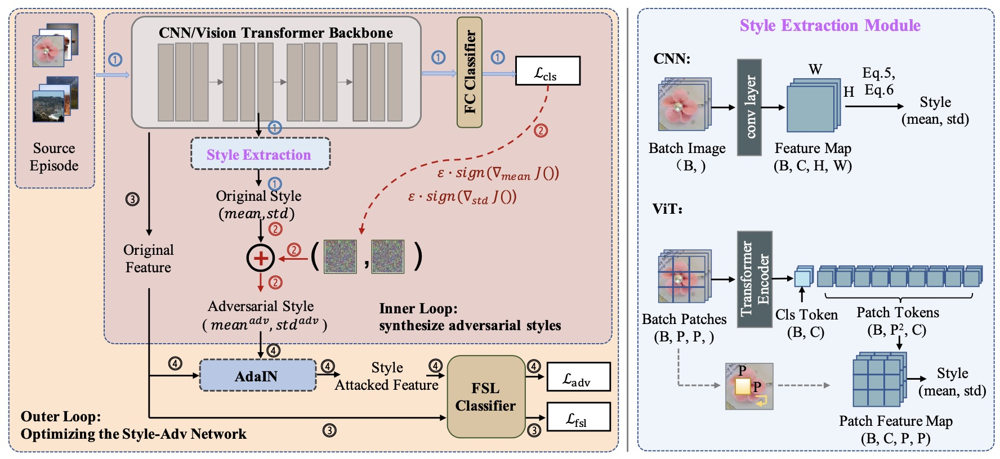
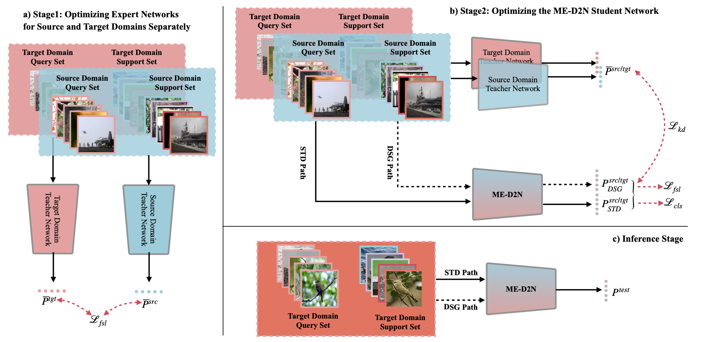



教育背景
------
* <strong>苏黎世联邦理工学院</strong> (2023-)
  * 博士后
* <strong>复旦大学</strong> (2018-2023)
  * 硕博连读生
  * GPA: 3.7/4.0 (<strong>专业第一</strong>)
  * 专业: 计算机应用技术
  * 研究方向：计算机视觉，尤其是小样本视频动作识别，跨域小样本学习
* <strong>浙江工业大学</strong> (2014-2018) (荣誉毕业生)
  * 工学学士
  * GPA: 4.2/5.0 (<strong>专业第一</strong>)
  * 专业: 计算机科学与技术及自动化双专业一体化

学术任职
------
* 期刊审稿人：IJCV, TIP, TMLR, TNNLS, Information Fusion, TMM, TCSVT, Neurocomputing, TOMM, MVAP
* 会议审稿人：CVPR(2023/24), ECCV-2024, ICCV-2023, ACM MM(2023/24), AAAI-2022, WACV-2024
<!-- * AAAI 2022 程序委员会成员（PC）-->

学术活动
------
* 2021/2022 国际青少年人工智能交流展示会（IAIF）<strong>专家评委</strong>
* 2021 世界人工智能大会（WAIC）<strong>秘书处成员</strong>
* 中国计算机学会（CCF）校园宣传大使 (2019-2022)

奖项荣誉
------
* 上海市优秀毕业生 (2023) 
* <strong>复旦大学优秀学生标兵</strong> (2021) (全校仅<strong>10</strong>名，<strong>Top 0.03%</strong>)
* 研究生<strong>国家奖学金</strong> (2019) (<strong>Top 2%</strong>)
* <strong>国家奖学金</strong> (2016, 2017) (<strong>Top 0.4%</strong>)
* <strong>CCF全国优秀大学生</strong> (2017) （全校仅<strong>2</strong>名）
* <strong>浙江省万名好党员</strong> （2018）（全校仅<strong>3</strong>名学生）
* 浙江省普通高等学校优秀毕业生 (2018) 
* 复旦英特尔冠名奖学金 （2022）
* 复旦华为冠名奖学金 （2021）
* 复旦大学优秀团干部 （2019）

科研工作
------
<table style="width:100%">
  <tr>
    <th width="30%">
      
    </th>
    <th style="text-align:left" width="70%">
            Open-Vocabulary Video Relation Extraction 
            Wentao Tian, Zheng Wang, Yuqian Fu, Jingjing Chen, Lechao Cheng 
            AAAI Conference on Artificial Intelligence (<strong>AAAI</strong>), 2024. 
            [<a href="https://arxiv.org/abs/2312.15670">论文</a>]
    </th>
  </tr> 
</table>

<table style="width:100%">
  <tr>
    <th width="30%">
      
    </th>
    <th style="text-align:left" width="70%">
            On the Importance of Spatial Relations for Few-shot Action Recognition 
            Yilun Zhang, Yuqian Fu, Xingjun Ma, Lizhe Qi, Jingjing Chen, Yu-Gang Jiang 
            ACM International Conference on Multimedia (<strong>ACM MM</strong>), 2023. 
            [<a href="https://arxiv.org/pdf/2308.07119.pdf">论文</a>]
    </th>
  </tr> 
</table>

<table style="width:100%">
  <tr>
    <th width="30%">
      
    </th>
     <th style="text-align:left" width="70%">
            StyleAdv: Meta Style Adversarial Training for Cross-Domain Few-Shot Learning 
            Yuqian Fu, Yu Xie, Yanwei Fu, Yu-Gang Jiang 
             IEEE/CVF Conference on Computer Vision and Pattern Recognition (<strong>CVPR</strong>), 2023 
            [<a href="https://arxiv.org/pdf/2302.09309.pdf">Paper</a>][<a href="https://github.com/lovelyqian/StyleAdv-CDFSL">Code</a>][<a href="https://youtu.be/YB-S2YF22mc">Youtube Video</a>][<a href="https://www.bilibili.com/video/BV1th4y1s78H/?spm_id_from=333.999.0.0&vd_source=668a0bb77d7d7b855bde68ecea1232e7">Bilibili Video</a>]
    </th>
  </tr> 
</table>

<table style="width:100%">
  <tr>
    <th width="30%">
      
    </th>
    <th style="text-align:left" width="70%">
            Generalized Meta-FDMixup: Cross-Domain Few-Shot Learning Guided by Labeled Target Data 
            Yuqian Fu, Yanwei Fu, Jingjing Chen, Yu-Gang Jiang 
            IEEE Transactions on Image Processinig (<strong>TIP</strong>), 2022. 
            [<a href="https://ieeexplore.ieee.org/stamp/stamp.jsp?tp=&arnumber=9942934">论文</a>]
    </th>
  </tr> 
</table>

<table style="width:100%">
  <tr>
    <th width="30%">
      
    </th>
    <th style="text-align:left" width="70%">
            ME-D2N: Multi-Expert Domain Decompositional Network for Cross-Domain Few-Shot Learning 
            Yuqian Fu, Yu Xie, Yanwei Fu, Jingjing Chen, Yu-Gang Jiang 
            ACM International Conference on Multimedia (<strong>ACM MM</strong>), 2022. 
            [<a href="https://arxiv.org/pdf/2210.05280.pdf">论文</a>][<a href="https://github.com/lovelyqian/ME-D2N_for_CDFSL">代码</a>][<a href="https://www.youtube.com/watch?v=crCoaBLuFeA">Youtube视频</a>][<a href="https://www.bilibili.com/video/BV1GG4y1p7if/?vd_source=668a0bb77d7d7b855bde68ecea1232e7">B站视频</a>]
    </th>
  </tr> 
</table>

<table style="width:100%">
  <tr>
    <th width="30%">
      
    </th>
    <th style="text-align:left" width="70%">
            TGDM: Target Guided Dynamic Mixup for Cross-Domain Few-Shot Learning 
            Linhai Zhuo, Yuqian Fu, Jingjing Chen, Yixin Cao, Yu-Gang Jiang 
            ACM International Conference on Multimedia (<strong>ACM MM</strong>), 2022. 
            [<a href="https://arxiv.org/pdf/2210.05392.pdf">论文</a>]
    </th>
  </tr> 
</table>

<table style="width:100%">
  <tr>
    <th width="30%">
       
    </th>
    <th style="text-align:left" width="70%">
  Wave-SAN: Wavelet based Style Augmentation Network for Cross-Domain Few-Shot Learning 
            Yuqian Fu, Yu Xie, Yanwei Fu, Jingjing Chen, Yu-Gang Jiang 
            arXiv preprint, 2022. 
            [<a href="https://arxiv.org/pdf/2203.07656.pdf">论文</a>]
    </th>
  </tr> 
</table>

<table style="width:100%">
  <tr>
    <th width="30%">
      
    </th>
    <th style="text-align:left" width="70%">
            Meta-FDMixup: Cross-Domain Few-Shot Learning Guided by Labeled Target Data 
            Yuqian Fu, Yanwei Fu, Yu-Gang Jiang 
            ACM International Conference on Multimedia (<strong>ACM MM</strong>), 2021. 
            [<a href="https://arxiv.org/pdf/2107.11978.pdf">论文</a>][<a href="https://github.com/lovelyqian/Meta-FDMixup">代码</a>][<a href="https://www.youtube.com/watch?v=G8Mlde4FpsU">Youtube视频</a>][<a href="https://www.bilibili.com/video/BV1xT4y1f7B6?spm_id_from=333.999.0.0&vd_source=668a0bb77d7d7b855bde68ecea1232e7">B站视频</a>]
    </th>
  </tr> 
</table>

<table style="width:100%">
  <tr>
    <th width="30%">
      
    </th>
    <th style="text-align:left" width="70%">
            Can Action be Imitated? Learn to Reconstruct and Transfer Human Dynamics from Videos 
            Yuqian Fu, Yanwei Fu, Yu-Gang Jiang 
            International Conference on Multimedia Retrieval (<strong>ICMR</strong>). 2021. (<strong>Oral</strong>) 
            [<a href="https://arxiv.org/pdf/2107.11756.pdf">论文</a>][<a href="https://www.bilibili.com/video/BV1VY41147xt?spm_id_from=333.999.0.0">B站视频</a>]
    </th>
  </tr> 
</table>

<table style="width:100%">
  <tr>
    <th width="30%">
      
    </th>
    <th style="text-align:left" width="70%">
             Depth Guided Adaptive Meta-Fusion Network for Few-shot Video Recognition 
            Yuqian Fu, Li Zhang, Junke Wang, Yanwei Fu, Yu-Gang Jiang 
            ACM International Conference on Multimedia (<strong>ACM MM</strong>), 2020. (<strong>Oral</strong>) 
            [<a href="https://arxiv.org/pdf/2010.09982.pdf">论文</a>][<a href="https://github.com/lovelyqian/AMeFu-Net">代码</a>][<a href="https://www.youtube.com/watch?v=KqNYuZD5xdw">Youtube视频</a>][<a href="https://www.bilibili.com/video/BV1i44y1t78U?spm_id_from=333.999.0.0">B站视频</a>]
    </th>
  </tr> 
</table>

<table style="width:100%">
  <tr>
    <th width="30%">
      
    </th>
    <th style="text-align:left" width="70%">
            Embodied One-Shot Video Recognition: Learning from Actions of a Virtual Embodied Agent 
            Yuqian Fu, Chengrong Wang, Yanwei Fu, Yu-Xiong Wang, Cong Bai, Xiangyang Xue, Yu-Gang Jiang 
            ACM International Conference on Multimedia (<strong>ACM MM</strong>), 2019. (<strong>Oral</strong>) 
             [<a href="http://www.cs.cmu.edu/~yuxiongw/research/Embodied_One-Shot_Video_Recognition_Learning_from_Actions_of_a_Virtual_Embodied_Agent.pdf">论文</a>][<a href="https://github.com/lovelyqian/Embodied-One-Shot-Video-Recognition">代码</a>][<a href="http://www.sdspeople.fudan.edu.cn/fuyanwei/dataset/UnrealAction/">UnrealAction数据集</a>]
    </th>
  </tr> 
</table>

学生工作
------
* 班级心理委员 （2021-2022）
* 学生团支部书记 (2018-2021)
* 学生党支部书记 （2017-2018）
* 新生助理班主任 （2015-2018）
* 体育部副部长 （2014-2016）

专业能力
------
* 编程语言：**Python**, **Pytorch**
* 专业工具：Latex, Vim, Matlab, Meshlab

更多信息
------
* 中文博客[在这里](https://www.jianshu.com/u/b3c66a77e742).

<!-- Publications
======
  <ul>
    
  </ul>
  
Talks
======
  <ul>
    
  </ul>
  
Teaching
======
  <ul>
    
  </ul> -->
  

